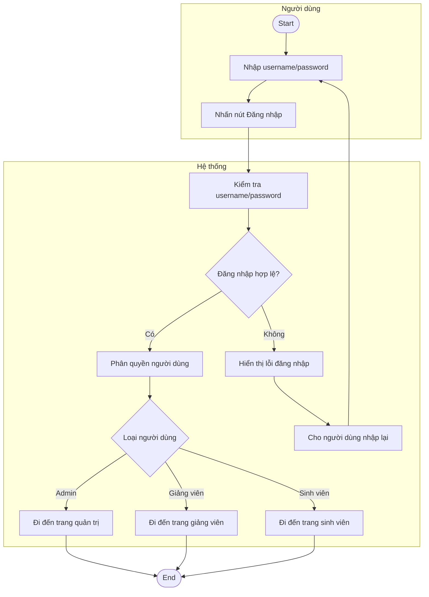
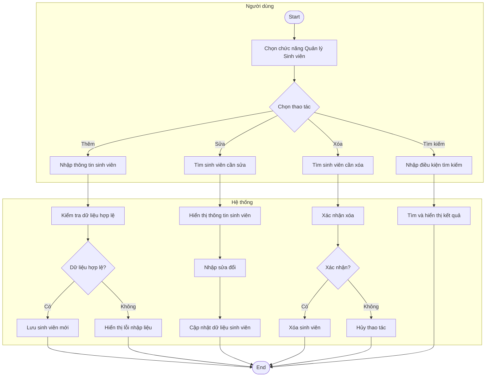
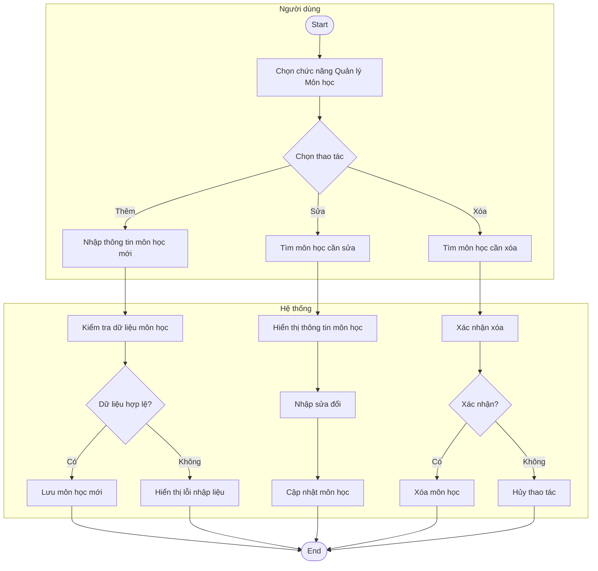
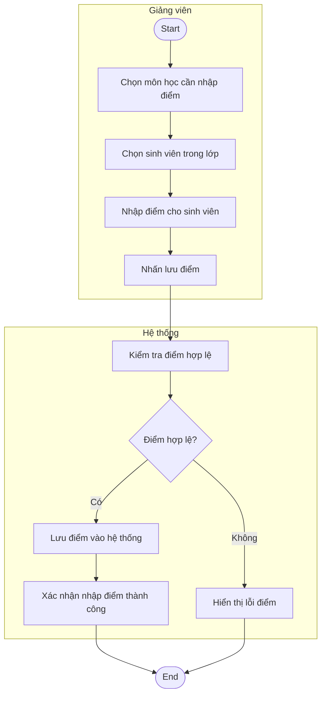

# Activity Diagram - UML

## 1. Luồng Đăng nhập

```mermaid
flowchart TB
    %% Swimlane phân chia Người dùng và Hệ thống
    subgraph User [Người dùng]
        A([Start]) --> B[Nhập username/password]
        B --> C[Nhấn nút Đăng nhập]
    end

    subgraph System [Hệ thống]
        C --> D[Kiểm tra username/password]
        D --> E{Đăng nhập hợp lệ?}
        E -- Có --> F[Phân quyền người dùng]
        F --> G{Loại người dùng}
        G -- Admin --> H[Đi đến trang quản trị]
        G -- Giảng viên --> I[Đi đến trang giảng viên]
        G -- Sinh viên --> J[Đi đến trang sinh viên]
        E -- Không --> K[Hiển thị lỗi đăng nhập]
        K --> L[Cho người dùng nhập lại]
        L --> B
    end

    H --> M([End])
    I --> M
    J --> M
```

## 2. Luồng Quản lý Sinh viên

```mermaid
flowchart TB
    subgraph User [Người dùng]
        A([Start]) --> B[Chọn chức năng Quản lý Sinh viên]
        B --> C{Chọn thao tác}
        C -- Thêm --> D[Nhập thông tin sinh viên]
        C -- Sửa --> E[Tìm sinh viên cần sửa]
        C -- Xóa --> F[Tìm sinh viên cần xóa]
        C -- Tìm kiếm --> G[Nhập điều kiện tìm kiếm]
    end

    subgraph System [Hệ thống]
        D --> H[Kiểm tra dữ liệu hợp lệ]
        H --> I{Dữ liệu hợp lệ?}
        I -- Có --> J[Lưu sinh viên mới]
        I -- Không --> K[Hiển thị lỗi nhập liệu]
        E --> L[Hiển thị thông tin sinh viên]
        L --> M[Nhập sửa đổi]
        M --> N[Cập nhật dữ liệu sinh viên]
        F --> O[Xác nhận xóa]
        O --> P{Xác nhận?}
        P -- Có --> Q[Xóa sinh viên]
        P -- Không --> R[Hủy thao tác]
        G --> S[Tìm và hiển thị kết quả]
    end

    J --> T([End])
    K --> T
    N --> T
    Q --> T
    R --> T
    S --> T
```

## 3. Luồng Quản lý Giảng viên

```mermaid
flowchart TB
    subgraph User [Người dùng]
        A([Start]) --> B[Chọn chức năng Quản lý Giảng viên]
        B --> C{Chọn thao tác}
        C -- Thêm --> D[Nhập thông tin giảng viên]
        C -- Sửa --> E[Tìm giảng viên cần sửa]
        C -- Xóa --> F[Tìm giảng viên cần xóa]
        C -- Tìm kiếm --> G[Nhập điều kiện tìm kiếm]
    end

    subgraph System [Hệ thống]
        D --> H[Kiểm tra dữ liệu hợp lệ]
        H --> I{Dữ liệu hợp lệ?}
        I -- Có --> J[Lưu giảng viên mới]
        I -- Không --> K[Hiển thị lỗi nhập liệu]
        E --> L[Hiển thị thông tin giảng viên]
        L --> M[Nhập sửa đổi]
        M --> N[Cập nhật dữ liệu giảng viên]
        F --> O[Xác nhận xóa]
        O --> P{Xác nhận?}
        P -- Có --> Q[Xóa giảng viên]
        P -- Không --> R[Hủy thao tác]
        G --> S[Tìm và hiển thị kết quả]
    end

    J --> T([End])
    K --> T
    N --> T
    Q --> T
    R --> T
    S --> T
```

## 4. Luồng Quản lý Môn học

```mermaid
flowchart TB
    subgraph User [Người dùng]
        A([Start]) --> B[Chọn chức năng Quản lý Môn học]
        B --> C{Chọn thao tác}
        C -- Thêm --> D[Nhập thông tin môn học mới]
        C -- Sửa --> E[Tìm môn học cần sửa]
        C -- Xóa --> F[Tìm môn học cần xóa]
    end

    subgraph System [Hệ thống]
        D --> G[Kiểm tra dữ liệu môn học]
        G --> H{Dữ liệu hợp lệ?}
        H -- Có --> I[Lưu môn học mới]
        H -- Không --> J[Hiển thị lỗi nhập liệu]
        E --> K[Hiển thị thông tin môn học]
        K --> L[Nhập sửa đổi]
        L --> M[Cập nhật môn học]
        F --> N[Xác nhận xóa]
        N --> O{Xác nhận?}
        O -- Có --> P[Xóa môn học]
        O -- Không --> Q[Hủy thao tác]
    end

    I --> R([End])
    J --> R
    M --> R
    P --> R
    Q --> R
```

## 5. Luồng Nhập điểm

```mermaid
flowchart TB
    subgraph User [Giảng viên]
        A([Start]) --> B[Chọn môn học cần nhập điểm]
        B --> C[Chọn sinh viên trong lớp]
        C --> D[Nhập điểm cho sinh viên]
        D --> E[Nhấn lưu điểm]
    end

    subgraph System [Hệ thống]
        E --> F[Kiểm tra điểm hợp lệ]
        F --> G{Điểm hợp lệ?}
        G -- Có --> H[Lưu điểm vào hệ thống]
        G -- Không --> I[Hiển thị lỗi điểm]
        H --> J[Xác nhận nhập điểm thành công]
    end

    J --> K([End])
    I --> K
```
