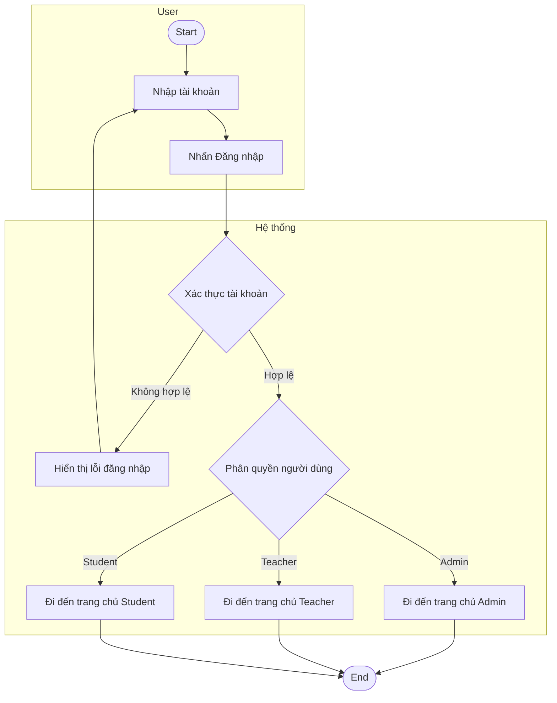
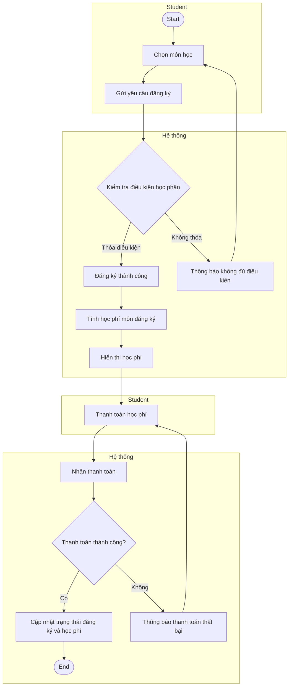
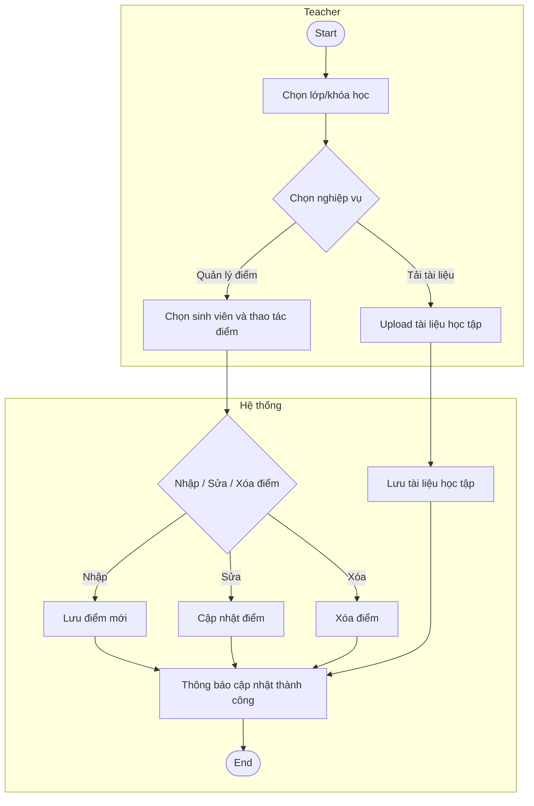
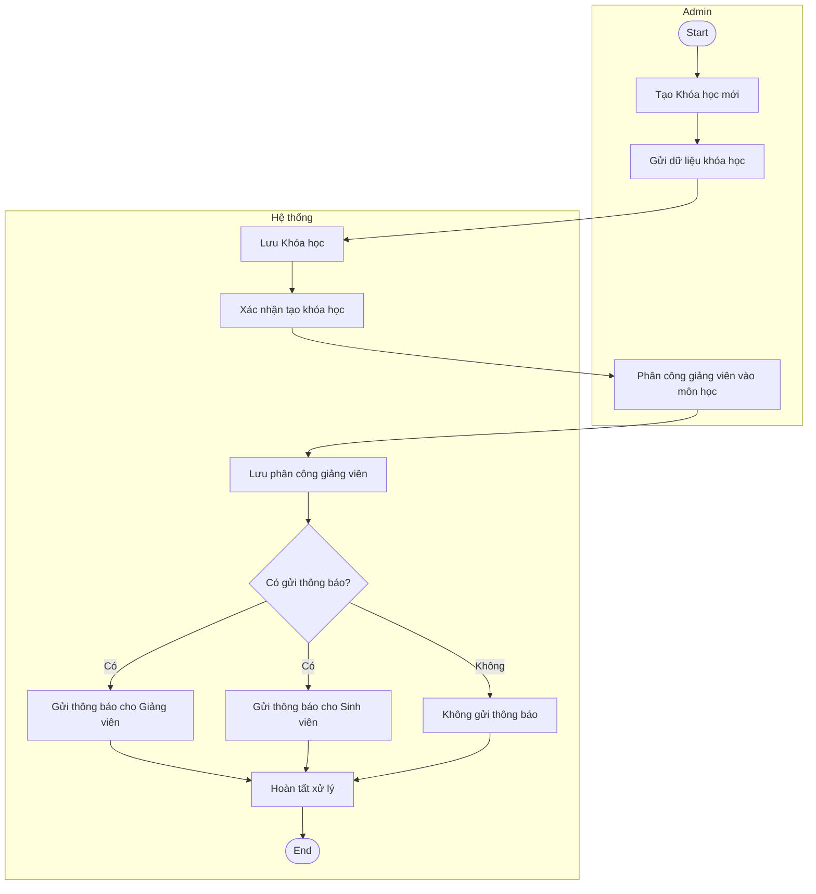

# Activity Diagram - UML

## 1. Luồng 1 - Đăng nhập & Điều hướng

## 2. Luồng 2 - Sinh viên: Đăng ký môn & Đóng học phí

## 3. Luồng 3 - Giảng viên: Quản lý lớp & Điểm số

## 4. Luồng 4 - Admin: Quản lý Đào tạo

